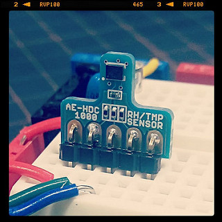
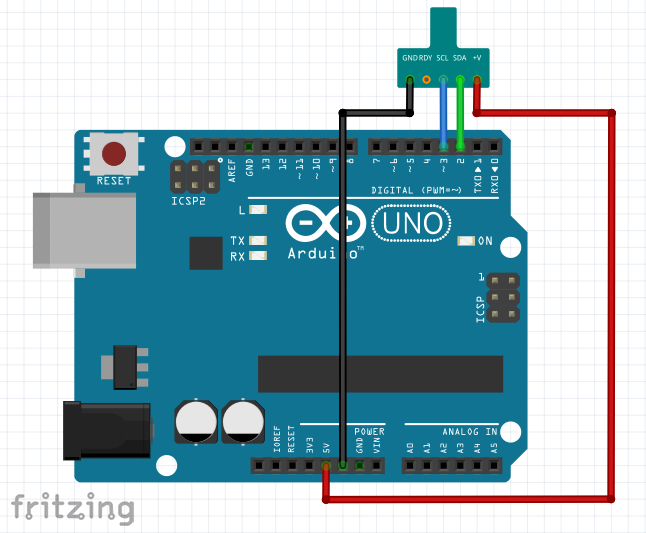

hdc1000_sample
====
HDC1000
* http://akizukidenshi.com/catalog/g/gM-08775/
* 

How to connect
----

    Arduino   HDC1000
    
      5V -----> +V
     GND -----> GND
      D2 -----> SDA (data)
      D3 -----> SCL (clock)
    

Copyright and license
----
Copyright (c) 2015 yoggy

Released under the [MIT license](LICENSE.txt)